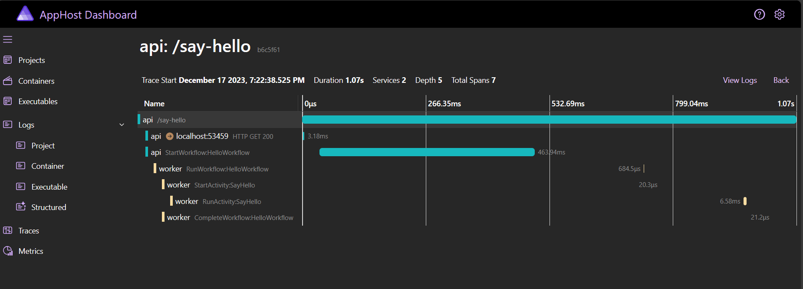
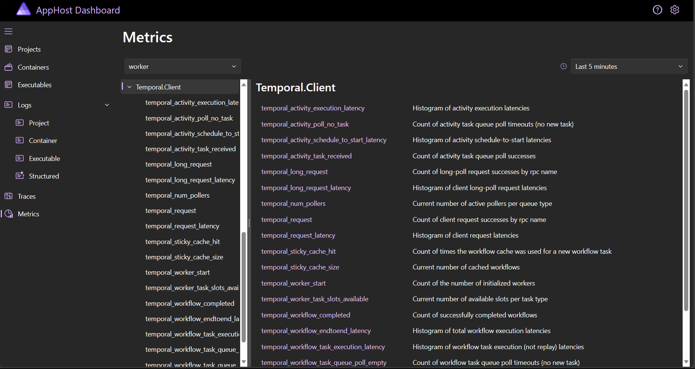

# Temporal Dev Server Aspire Component

 [](http://www.nuget.org/profiles/Orleans)
 
 [](https://discord.gg/PXJFbP7PKk)

Aspire extension to start the temporal cli dev server as an container or executable resource. 
**Note: Only container works as expected. See https://github.com/dotnet/aspire/issues/1637 and https://github.com/temporalio/cli/issues/316**

## Contents:
- [Pre-Requisites](#pre-requisites)
- [Getting Started](#getting-started)
- [Observability](#observability)
- [Configuration](#configuration)

## Pre-requisites

- [Temporal CLI](https://github.com/temporalio/cli) (ensure the binary is in your PATH)
- An Aspire project. See [Aspire docs](https://learn.microsoft.com/en-us/dotnet/aspire/get-started/aspire-overview) to get started.

## Getting Started

### 1. Install the nuget package

```sh
dotnet add package Asspire.Temporal.Server
```

### 2. Add Temporal dev server to your Aspire AppHost Program.cs

```csharp
// AppHost/Program.cs
using Aspire.Temporal.Server;

var builder = DistributedApplication.CreateBuilder(args);

// Use the default server options
var temporal = await builder.AddTemporalServerContainer("temporal")

// OR customise server options with builder
//      see config section for details
var temporal = await builder.AddTemporalServerContainer("temporal", x => x
    .WithLogFormat(LogFormat.Json)
    .WithLogLevel(LogLevel.Info)
    .WithNamespace("test1", "test2"));
```

### 3. Run the Aspire application

You should see Temporal running under the Executables tab.

Temporal will be available on its default ports:
- Server: http://localhost:7233
- UI: http://localhost:8233


### 4. Configure Client/Worker Applications

The Temporal client can then be added to a .NET project as normal using the instructions from the [temporal dotnet sdk repo](https://github.com/temporalio/sdk-dotnet/)

It can be included in Aspire orchestration like below and can optionally take a reference to the Temporal resource.

```csharp
// ./samples/AppHost/Program.cs

// ...

var temporal = builder.AddTemporalServerExecutable("temporal");

builder.AddProject<Projects.Worker>("worker") // my custom project
    .WithReference(temporal);

// ...
```

If using [Temporalio.Extensions.Hosting](https://github.com/temporalio/sdk-dotnet/blob/main/src/Temporalio.Extensions.Hosting/README.md) the client registration might look something like below. If we took the reference to the Temporal Aspire resource, then the TargetHost property is automatically injected under the key `ConnectionStrings:<Aspire Resource Name>`. (e.g., this will be `builder.Configuration["ConnectionStrings:temporal"]` for a resource named "temporal" as above)

```csharp
// register a client -  ./samples/Api/Program.cs
builder.Services
    .AddTemporalClient(opts =>
    {
        opts.TargetHost = builder.Configuration["ConnectionStrings:temporal"]; // or just self-configure localhost:7233
        opts.Namespace = "default";
    })

// or

// register a worker - ./samples/Worker/Program.cs
builder.Services
    .AddTemporalClient(opts =>
    {
        opts.TargetHost = builder.Configuration["ConnectionStrings:temporal"]; // or just self-configure localhost:7233
        opts.Namespace = "default";
    })
    .AddHostedTemporalWorker("my-task-queue")
    .AddScopedActivities<MyActivities>()
    .AddWorkflow<MyWorkflow>();
```

## Observability

The extension doesn't provide any setup for observability, but you can follow [Temporalio.Extensions.DiagnosticSource](https://github.com/temporalio/sdk-dotnet/blob/main/src/Temporalio.Extensions.DiagnosticSource/README.md) and [Temporalio.Extensions.Hosting](https://github.com/temporalio/sdk-dotnet/blob/main/src/Temporalio.Extensions.Hosting/TemporalHostingServiceCollectionExtensions.cs) to configure this on the temporal client. If using the Aspire Service Defaults, you'll need to configure the metrics and tracing accordingly.

The sample folder has an example for configuring this with the Aspire Dashboard

- [sample/Api/Program.cs](./sample/Api/Program.cs) for an example client
- [sample/Worker/Program.cs](./sample/Worker/Program.cs) for an example worker
- [sample/ServiceDefaults/Extensions.cs](./sample/ServiceDefaults/Extensions.cs) for an example of adding the custom meter and tracing sources to the service defaults.

If done correctly, you should tracing and metrics on the Aspire dashboard:

#### Tracing



#### Metrics




## Configuration

The dev server can be configured with a fluent builder

```csharp
await builder.AddTemporalServerContainer("temporal", builder => builder.WithPort(1234))
```

You can run `temporal server start-dev --help` to get more information about the CLI flags on the dev server. All available flags are mapped to a method on the builder.

Available methods:

```csharp
builder
    .WithDbFileName("/location/of/persistent/file") // --db-filename
    .WithNamespace("namespace-name", ...)           // --namespace
    .WithPort(7233)                                 // --port
    .WithHttpPort(7234)                             // --http-port
    .WithMetricsPort(7235)                          // --metrics-port
    .UiPort(8233)                                   // --ui-port
    .WithHeadlessUi(true)                           // --headless
    .WithIp("127.0.0.1")                            // --ip
    .WithUiIp("127.0.0.1")                          // --ui-ip
    .WithUiAssetPath("/location/of/custom/assets")  // --ui-asset-path
    .WithUiCodecEndpoint("http://localhost:8080")   // --ui-codec-endpoint
    .WithLogFormat(LogFormat.Pretty)                // --log-format
    .WithLogLevel(LogLevel.Info)                    // --log-level
    .WithSQLitePragma(SQLitePragma.JournalMode)     // --sqlite-pragma
```
