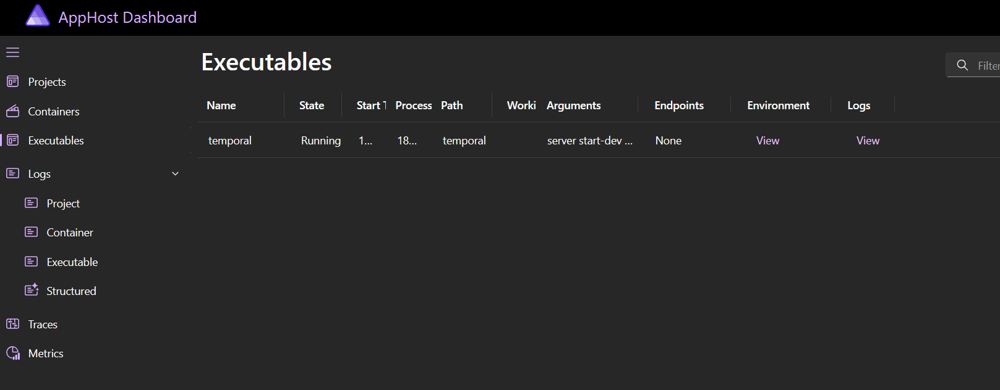

# Temporal Dev Server Aspire Component

Aspire extension to start the temporal cli dev server as an executable resource

## Pre-requisites

- [Temporal CLI](https://github.com/temporalio/cli) (ensure the binary is in your PATH)
- An Aspire project. See [Aspire docs](https://learn.microsoft.com/en-us/dotnet/aspire/get-started/aspire-overview) to get started.

## Getting Started

### 1. Install the nuget package

```sh
dotnet add package sains1.Aspire.Temporal.Server
```

### 2. Add Temporal dev server to your Aspire AppHost Program.cs

```csharp
// AppHost/Program.cs
using Aspire.Temporal.Server;

var builder = DistributedApplication.CreateBuilder(args);

// Use the default server options
var temporal = builder.AddTemporalServerExecutable("temporal");

// OR customise server options with builder
//      see config section for details
var temporal = builder.AddTemporalServerExecutable("temporal", x => x.WithNamespace("test1", "test2"));


// ...
```

### 3. Run the Aspire application

You should see Temporal running under the Executables tab.

Temporal will be available on its default ports:
- Server: http://localhost:7233
- UI: http://localhost:8233

