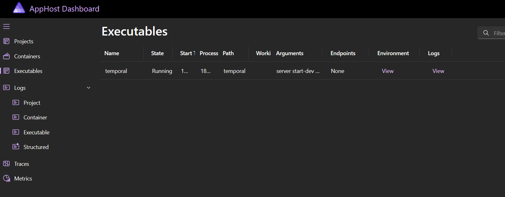
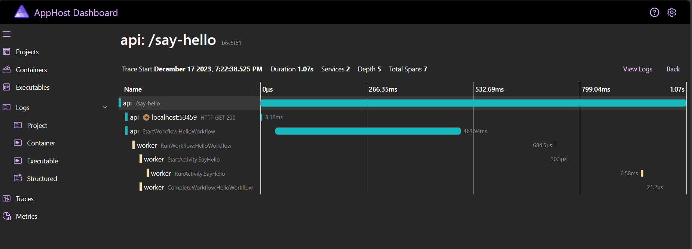
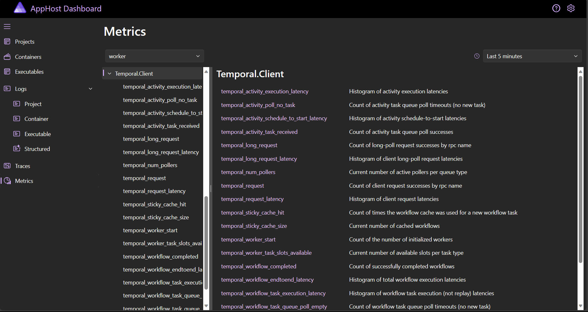

# InfinityFlow.Aspire.Temporal

[](https://www.nuget.org/packages/InfinityFlow.Aspire.Temporal)

[](https://discord.gg/PXJFbP7PKk)

Aspire extension to start the Temporal CLI dev server as a container or executable resource, with an optional client library for automatic connection string resolution and OpenTelemetry integration.

**Note: Only container works as expected. See https://github.com/dotnet/aspire/issues/1637 and https://github.com/temporalio/cli/issues/316**


## Contents:
- [Pre-Requisites](#pre-requisites)
- [Getting Started](#getting-started)
- [Client Library](#client-library)
- [Observability](#observability)
- [Configuration](#configuration)

## Pre-requisites

- An Aspire project. See [Aspire docs](https://learn.microsoft.com/en-us/dotnet/aspire/get-started/aspire-overview) to get started.
- [Temporal CLI](https://github.com/temporalio/cli) (only if using the executable resource)

## Getting Started

### 1. Install the NuGet packages

```sh
# Hosting library (AppHost project)
dotnet add package InfinityFlow.Aspire.Temporal

# Client library (Worker/API projects)
dotnet add package InfinityFlow.Aspire.Temporal.Client
```

### 2. Add Temporal dev server to your Aspire AppHost

```csharp
// AppHost/Program.cs
using InfinityFlow.Aspire.Temporal;

var builder = DistributedApplication.CreateBuilder(args);

// Container resource (recommended)
var temporal = builder.AddTemporalServerContainer("temporal")
    .WithLogFormat(LogFormat.Json)
    .WithLogLevel(LogLevel.Info)
    .WithNamespace("test1", "test2")
    .WithDynamicConfigValue("frontend.enableUpdateWorkflowExecution", true);

// With fixed ports (dynamic by default)
var temporalWithPorts = builder.AddTemporalServerContainer("temporalWithPorts")
    .WithServicePort(7233)
    .WithUiPort(8233);

// Reference from your projects
builder.AddProject<Projects.Worker>("worker")
    .WithReference(temporal);

builder.AddProject<Projects.Api>("api")
    .WithReference(temporal);

builder.Build().Run();
```

### 3. Run the Aspire application

You should see Temporal running under the Containers tab.



## Client Library

The `InfinityFlow.Aspire.Temporal.Client` package provides automatic connection string resolution, OpenTelemetry integration, and health checks.

### Register a worker

```csharp
// Worker/Program.cs
using InfinityFlow.Aspire.Temporal.Client;

var builder = Host.CreateApplicationBuilder(args);

builder.AddTemporalWorker("temporal", "my-task-queue", opts =>
{
    opts.Namespace = "my-namespace";
})
.AddWorkflow<MyWorkflow>()
.AddScopedActivities<MyActivities>();

builder.Build().Run();
```

### Register a client

```csharp
// Api/Program.cs
using InfinityFlow.Aspire.Temporal.Client;

var builder = WebApplication.CreateBuilder(args);

builder.AddTemporalClient("temporal", opts =>
{
    opts.Namespace = "my-namespace";
});

var app = builder.Build();
// ...
```

Both `AddTemporalWorker` and `AddTemporalClient` automatically:
- Resolve the connection string from the Aspire resource reference
- Register a `TracingInterceptor` for distributed tracing
- Set up a `TemporalRuntime` with `CustomMetricMeter` for metrics
- Add a health check for the Temporal connection

## Observability

### Service Defaults

Add `AddTemporalServiceDefaults()` in your service defaults to wire up OpenTelemetry meters and tracing sources:

```csharp
// ServiceDefaults/Extensions.cs
using InfinityFlow.Aspire.Temporal.Client;

builder.Services.AddTemporalServiceDefaults();
```

This registers the Temporal meter and `TracingInterceptor` activity sources with the OpenTelemetry pipeline. See the [sample](./sample/) for a complete example.

If done correctly, you should see tracing and metrics on the Aspire dashboard:

#### Tracing



#### Metrics




## Configuration

The dev server is configured with fluent extension methods:

```csharp
builder.AddTemporalServerContainer("temporal")
    .WithDbFileName("/location/of/persistent/file") // --db-filename
    .WithNamespace("namespace-name")                 // --namespace
    .WithServicePort(7233)                           // external host port (container internal is always 7233)
    .WithHttpPort()                                  // --http-port
    .WithMetricsEndpoint()                           // --metrics-port
    .WithUiPort(8233)                                // external host port (container internal is always 8233)
    .WithHeadlessUi()                                // --headless
    .WithIp("127.0.0.1")                             // --ip
    .WithUiIp("127.0.0.1")                           // --ui-ip
    .WithUiAssetPath("/location/of/custom/assets")   // --ui-asset-path
    .WithUiCodecEndpoint("http://localhost:8080")     // --ui-codec-endpoint
    .WithLogFormat(LogFormat.Pretty)                  // --log-format
    .WithLogLevel(LogLevel.Info)                      // --log-level
    .WithSQLitePragma(SQLitePragma.JournalMode)       // --sqlite-pragma
    .WithDynamicConfigValue("key", value)             // --dynamic-config-value
    .WithLogConfig(true)                               // --log-config
    .WithSearchAttribute("MyKey", SearchAttributeType.Keyword) // --search-attribute
    .WithUiPublicPath("/temporal");                    // --ui-public-path
```

You can run `temporal server start-dev --help` to get more information about the CLI flags on the dev server.
